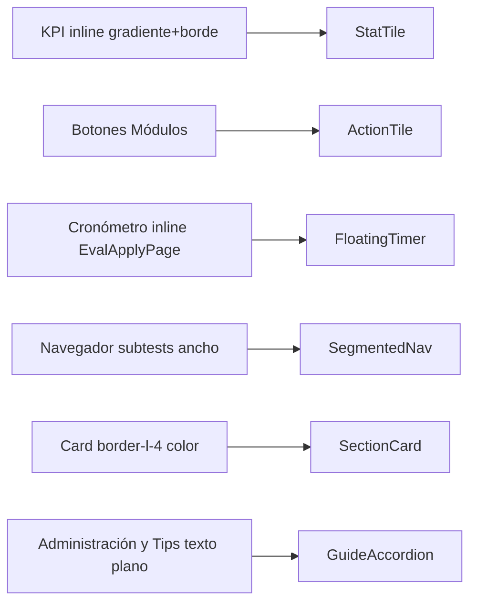
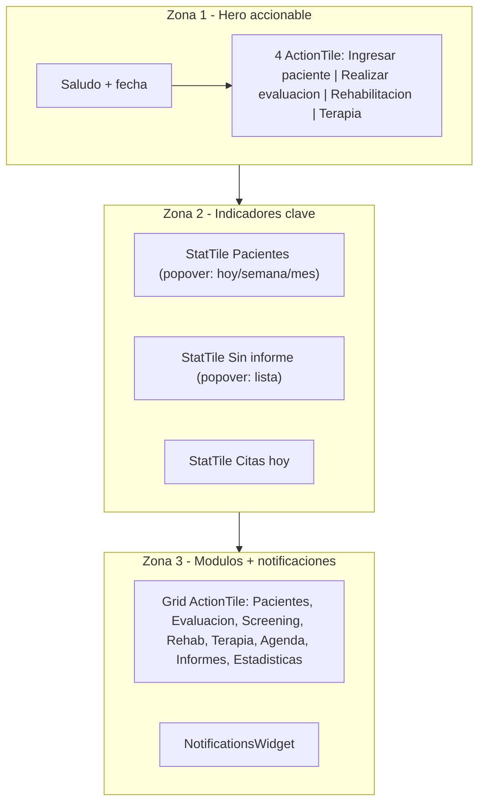
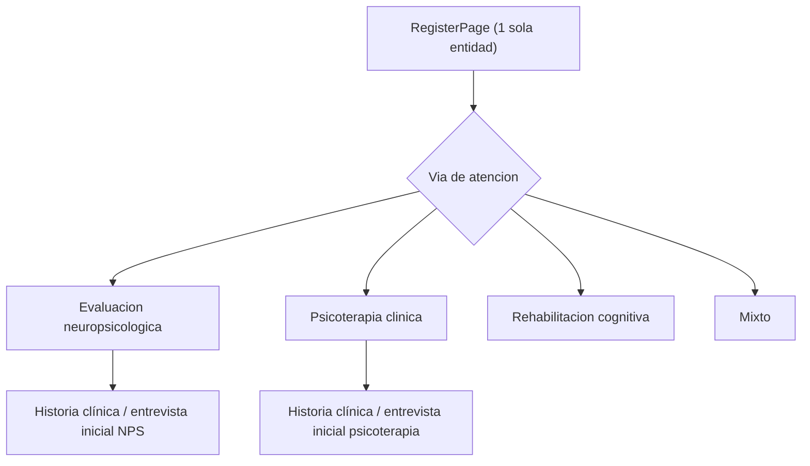
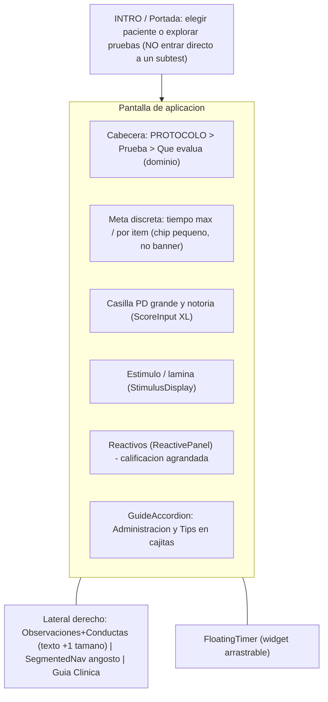
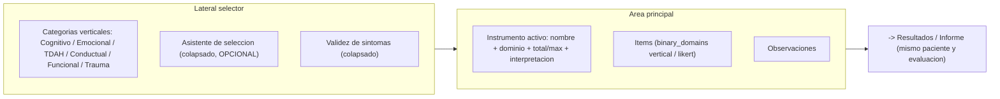
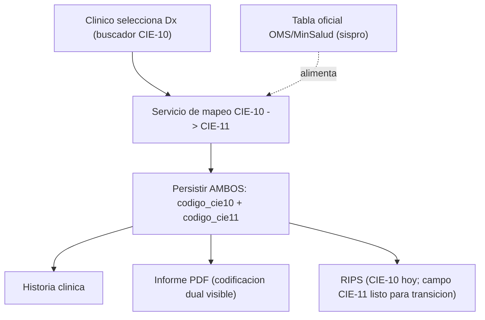
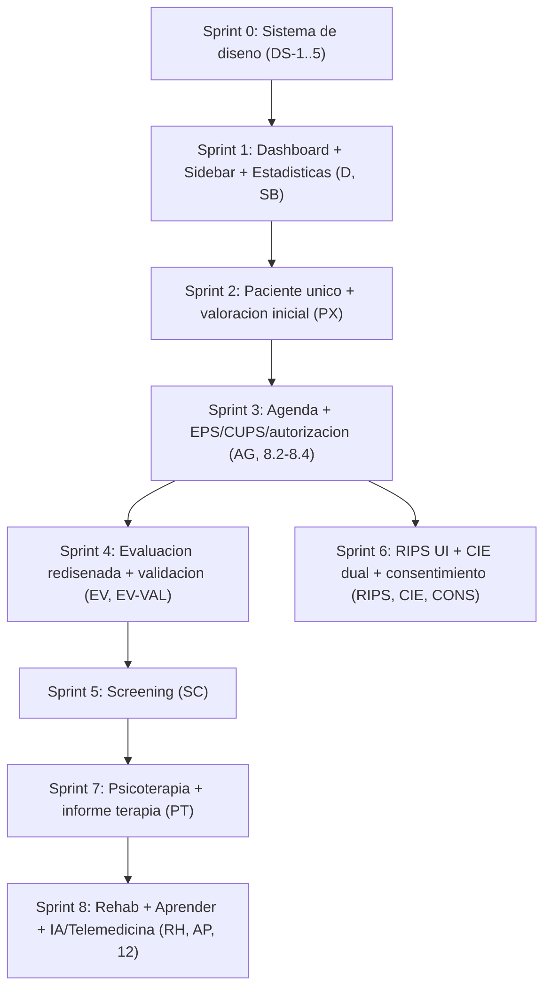

# PLAN MAESTRO DE DESARROLLO — NeuroSoft App

> **Rol del documento:** guía técnica única y ejecutable para reorganizar la UI/UX, completar los módulos clínicos y cerrar los requisitos normativos colombianos (CIE-11, RIPS, consentimiento).
> **Audiencia:** agente de codificación (Composer / Opus / Codex) que ejecutará por sprints modulares.
> **Autor del análisis:** Director de Orquesta / Arquitecto Principal.
> **Fecha:** Junio 2026.
> **Regla de oro:** este archivo CRUZA dos fuentes — las notas de uso (`1. LEER PROMPT.txt`) y la investigación clínico-normativa (`2. INVESTIGACION REVISAR.txt`) — contra la arquitectura real del repositorio. Ningún paso debe inventar baremos, DOIs ni códigos: lo que no esté verificado se marca con `[VERIFICAR]`.

---

## 0. Cómo usar este plan

1. Cada sección mayor (Dashboard, Agenda, Evaluación, Screening, Psicoterapia, Rehabilitación, RIPS/Normativa, Aprender) es **independiente y commiteable por separado**.
2. Cada tarea tiene un ID (`D-1`, `AG-2`, `EV-3`...) para trazabilidad y para marcar progreso en `docs/ESTADO_VIVO.md`.
3. Antes de tocar `strategies.py`, `engine.py` o `baremos_loader.py` correr los 27 tests del motor (regla del `clinical-engine-reviewer`).
4. **No** modificar `data/BD_NEURO_MAESTRA.json` sin preguntar.
5. Todo color debe salir de `src/ui/tokens.js` o variables `--ns-*`. **Prohibido** el `border-l-4 border-<color>-400` que produce el look "cajita de IA".
6. Stack cerrado: React 18 + Vite + Tailwind (JSX puro, sin TS), FastAPI + SQLAlchemy + SQLite, PyInstaller + Inno Setup. No proponer Electron/Tauri/Next/TS.

### Estado del arte (lo que YA existe y se reutiliza)

| Capacidad | Dónde vive hoy | Estado |
|---|---|---|
| Navegación SPA por estado | `neurosoft-frontend/src/App.jsx` (objeto `pages`, `setPage`) | OK, se reorganiza el árbol |
| Sidebar | `neurosoft-frontend/src/app/layout/Sidebar.jsx` (`GROUPS`) | Se reagrupa |
| Tokens de diseño v2 | `neurosoft-frontend/src/ui/tokens.js` | Buena base editorial — falta aplicarla |
| Primitivas UI | `neurosoft-frontend/src/ui/primitives.jsx` (`Card`, `Btn`, `TopBar`, `Sel`...) | Se amplía con nuevos componentes |
| Export RIPS TXT/ZIP/PDF mensual | `neurosoft-backend/app/infrastructure/rips_service.py` | **Existe sin UI frontend** |
| Mapa CIE-10→CIE-11 | `neurosoft-frontend/src/data/cie11Map.js` (16 entradas) | Parcial, frontend-only |
| Catálogo CIE-10 backend | `neurosoft-backend/app/domain/data/cie10_es.json` + `cie10_router` | OK |
| Campos seguro/RIPS en paciente | `PatientORM` (`eps`, `codigo_rips`, `cups`, `orden_medica_no`, `discapacidad`) | OK, falta validación y catálogo EPS |
| Cronómetro | inline en `EvalApplyPage.jsx` (~líneas 388-436) | Se extrae a widget flotante |
| Validación de puntaje | `ScoreInput.jsx` (`SANITY_RANGES`, solo visual) | Se endurece contra baremo |

---

## 1. SISTEMA DE DISEÑO — "Editorial Clínico" (elimina el look de IA)

> Esta sección es **prerrequisito transversal**. Todos los módulos consumen estos componentes. Es lo que mata las "cajitas con bordes de colores de Claude".

### 1.1 Diagnóstico del problema

El look "IA genérica" proviene de tres patrones repetidos en el código:
- `border-l-4 border-teal-400` / `border-<color>-400` (barras laterales de color en cada Card).
- KPIs como cajas con gradiente y borde de color (`DashboardPage.jsx` hero usa `linear-gradient(135deg, ${NAVY}08, ${TEAL}08)` con `borderColor: ${TEAL}25`).
- Densidad inconsistente: todo apilado verticalmente con el mismo peso visual.

### 1.2 Principios del sistema "Editorial Clínico"

1. **Jerarquía por tipografía, no por color.** Serif (Lora) para títulos de sección, sans (Manrope) para cuerpo — ya definido en `TYPOGRAPHY` de `tokens.js`.
2. **Hairline borders (1px `--ns-border`)**, nunca barras de color de 4px. El color es semántico y puntual (un punto, un texto, un icono), no decorativo.
3. **NAVY protagonista, TEAL acento minoritario** (ya es la intención declarada en `tokens.js`).
4. **Superficies cálidas** (`PAPER #FCFAF4`) y sombras azuladas sutiles (`SHADOWS.editorial`).
5. **Densidad clínica:** menos aire muerto, agrupación por tarjetas con cabecera tipográfica (no por marco de color).

### 1.3 Nuevos componentes a crear en `src/ui/`

| Componente | Archivo nuevo | Reemplaza a | Descripción |
|---|---|---|---|
| `StatTile` | `src/ui/StatTile.jsx` | KPIs inline del dashboard | Indicador editorial: número grande (Lora), label micro uppercase, sin borde de color; estado expandible al hover (popover con desglose mes/semana/día) |
| `ActionTile` | `src/ui/ActionTile.jsx` | botones "Módulos" del dashboard | Botón de acción rápida con icono Material, título, subtítulo; hover sube `SHADOWS.md`; navega vía `setPage` |
| `FloatingTimer` | `src/ui/FloatingTimer.jsx` | cronómetro inline de `EvalApplyPage` | Widget flotante (esquina inferior derecha), arrastrable, minimizable a píldora; anillo SVG de progreso; persiste posición en localStorage |
| `SegmentedNav` | `src/ui/SegmentedNav.jsx` | Navegador de subtests | Navegador vertical angosto con abreviaturas (DC, SEM, RETEDIG); estado por subtest (vacío/parcial/completo) por punto de color, no por caja |
| `SectionCard` | `src/ui/SectionCard.jsx` | `Card` con `border-l-4` | Card editorial: cabecera con título serif + icono fino + línea hairline inferior; cero borde lateral de color |
| `GuideAccordion` | `src/ui/GuideAccordion.jsx` | bloque "Administración y Tips" inline | Acordeón de cajitas desglosadas (Materiales / Instrucción / Discontinuación / Calificación / Tips) en vez de texto plano corrido |
| `Popover` | `src/ui/Popover.jsx` | — | Primitiva accesible (Esc, click-outside) para los hovers de indicadores |

### 1.4 Tareas

- **`DS-1`** Crear `StatTile`, `ActionTile`, `SectionCard`, `Popover` en `src/ui/`. Usar exclusivamente tokens de `tokens.js`.
- **`DS-2`** Crear `FloatingTimer` (extraer lógica del cronómetro de `EvalApplyPage.jsx`: estados `timer`, `timerOn`, beep Web Audio, tecla Espacio, `ns-pulse-red`). **Nota (evidencia visual):** el cronómetro actual YA tiene un estilo oscuro pulido (anillo SVG + play/pausa/reset + "EN PAUSA"); el problema NO es su estética sino que está incrustado en la cabecera ocupando todo el ancho ("atravesado"). `FloatingTimer` debe **preservar ese diseño** y solo convertirlo en widget flotante, arrastrable y minimizable a píldora.
- **`DS-3`** Crear `SegmentedNav` y `GuideAccordion`.
- **`DS-4`** Auditar y eliminar todos los `border-l-4 border-*-400` del repo (grep `border-l-4`) reemplazando por `SectionCard`. Respetar dark mode (`--ns-*`).
- **`DS-5`** Documentar en `neurosoft-frontend/CLAUDE.md` la regla "no barras de color; usar SectionCard".

### 1.5 Mapa de migración de componentes

---

## 2. DASHBOARD / INICIO

**Archivo:** `neurosoft-frontend/src/app/dashboard/DashboardPage.jsx`

### 2.1 Problemas reportados (de tus notas)
- Demasiada información apilada sin sub-orden.
- El banner "Buenas tardes" parece accionable pero no lo es (debería tener accesos rápidos clickeables).
- Indicadores con look de IA (borde de color) y ocupan demasiado espacio.
- Gráfico de tendencia y demografía sobran aquí → moverlos a "Estadísticas".
- Módulos: debería incluir Agenda y lo demás.

### 2.2 Diseño propuesto (3 zonas)

### 2.3 Mapeo de componentes

| Elemento actual | Acción | Componente destino |
|---|---|---|
| Hero informativo no clickeable | Convertir en accesos rápidos | 4× `ActionTile` (Ingresar paciente→`register`, Realizar evaluación→`evaluation`, Rehabilitación→`rehab`, Terapia→`therapy`) |
| 5 KPIs con borde de color | Reducir a 2-3 indicadores con popover de desglose | `StatTile` + `Popover` |
| Gráfico de tendencia (SVG inline) | Mover a nueva página `estadisticas` | nuevo `EstadisticasPage.jsx` |
| Donut demografía | Mover a `estadisticas` | idem |
| Bloque adherencia rehab | Mantener condicional (solo si hay planes) | `SectionCard` |
| Grid "Módulos" | Ampliar e incluir Agenda + Estadísticas | `ActionTile` grid |
| Población atendida (barras) | Mover a `estadisticas` | idem |

### 2.4 Tareas
- **`D-1`** Reescribir `DashboardPage.jsx` con las 3 zonas usando `ActionTile`/`StatTile`/`SectionCard`.
- **`D-2`** Crear `src/app/dashboard/EstadisticasPage.jsx` (tendencia + demografía + población) y registrar `estadisticas` en `App.jsx` y sidebar (grupo Clínica).
- **`D-3`** Implementar popover de desglose en `StatTile` (Pacientes → hoy/semana/mes/año; Sin informe → lista navegable a `reports`). Reusar `GET /api/v1/patients/stats` y `GET /api/v1/evaluations/trend`.
- **`D-4`** El hero ya no usa gradiente con borde de color; fondo `PAPER`, separador hairline.

---

## 3. PANEL IZQUIERDO (SIDEBAR) — reorganización

**Archivo:** `neurosoft-frontend/src/app/layout/Sidebar.jsx` (objeto `GROUPS`)

### 3.1 Problemas
- Demasiadas entradas; "Historial" y "Pre-Post" no deberían ser navegación primaria.
- "Nueva evaluación" (CTA del footer) no sirve sin paciente → debería ser "Nuevo paciente".
- "Registro de cambios" duplica "Ayuda".
- Módulo "Aprender" infla el panel (8 entradas) → colapsar bajo "Centro de aprendizaje".

### 3.2 Árbol propuesto

| Grupo | Entradas | Cambios |
|---|---|---|
| **Clínica** | Inicio, Pacientes, Agenda, Estadísticas | + Estadísticas (nueva) |
| **Evaluación** | Aplicar evaluación, Screening, Informes | Historial y Pre-Post salen del nivel 1 |
| **Psicoterapia** | Sesiones clínicas | (se enriquece, ver §7) |
| **Rehabilitación** | Plan & Actividades | — |
| **Aprender** | Centro de aprendizaje (hub único) | Glosario/Tarjetas/Quiz/Artículos/Simulador/Biblioteca pasan a ser **tabs dentro del hub**, no entradas de sidebar |
| **Herramientas** | Asistente IA, Telemedicina, Ayuda | "Registro de cambios" se vuelve tab dentro de Ayuda |

- **Historial** y **Pre-Post**: accesibles **contextualmente** desde la ficha del paciente y desde la página de Pacientes (acción por fila), no como ítem de sidebar.
- **Pruebas disponibles**: pasa a Configuración (es catálogo/ajustes), como sugieren tus notas.

### 3.3 Tareas
- **`SB-1`** Reescribir `GROUPS` en `Sidebar.jsx` según la tabla.
- **`SB-2`** Cambiar el CTA del footer de "Nueva evaluación" → "Nuevo paciente" (`register`).
- **`SB-3`** Convertir `AprenderHub.jsx` en hub con tabs internos; quitar las 6-7 entradas de sidebar (mantener solo `aprender`). Arreglar el `aprender_protocolos` roto (registrar página o quitar enlace).
- **`SB-4`** Mover "Pruebas disponibles" a `ConfigPage`. Mover "Registro de cambios" como tab de `HelpPage`.
- **`SB-5`** Añadir acciones "Historial" y "Pre-Post" en la fila de paciente de `PatientsPage.jsx` y en la ficha clínica.

---

## 4. MODELO DE ENTREVISTA / FLUJO DE PACIENTE (decisión de arquitectura)

> Responde tu duda: ¿un módulo de paciente o dos (neuro vs clínica)?

### 4.1 Decisión: **una sola entidad Paciente + "vía de atención"**

Mantener `PatientORM` único (evita duplicar HC, consentimiento, RIPS). Al **guardar** el paciente se elige una o varias **vías de atención** que enrutan el flujo:

### 4.2 Modelo de entrevista neuropsicológica profesional (estructura de la valoración inicial)

Basado en práctica clínica estándar (motivo → antecedentes → examen → impresión). La entrevista inicial se organiza como un **wizard por secciones colapsables**, no un formulario plano:

1. **Identificación y vía de atención** (quién deriva, EPS, finalidad).
2. **Motivo de consulta** (texto + checklist de quejas: memoria, atención, lenguaje, conducta, ánimo).
3. **Historia de la enfermedad actual** (inicio, curso, factores).
4. **Antecedentes** (médicos, neurológicos, psiquiátricos, farmacológicos, perinatales/desarrollo si pediátrico, escolaridad, ocupacionales).
5. **Queja subjetiva de memoria** (versión paciente + versión familiar/acompañante) — *los textos verbatim de la escala deben buscarse y transcribirse fieles; si no se está seguro, marcar `[VERIFICAR]` y no inventar*.
6. **Examen del estado mental / observación conductual**.
7. **Hipótesis y plan de evaluación** (sugiere protocolo + screening; engancha con `screeningSugerencias.js` y `protocolosOrden.js`).

### 4.3 Tareas
- **`PX-1`** Añadir campo `via_atencion` (multi) a `PatientORM`, DTO y migración Alembic (`007`). Valores: `neuropsicologia`, `psicoterapia`, `rehabilitacion`, `mixto`.
- **`PX-2`** En `RegisterPage.jsx`, paso final = selección de vía de atención y redirección contextual (no a la lista genérica).
- **`PX-3`** Reestructurar `ClinicalHistoryPage.jsx` como wizard de 7 secciones colapsables (`SectionCard` + `GuideAccordion`), con la versión paciente/familiar de queja de memoria.
- **`PX-4`** En la ficha del paciente, el botón "Nueva evaluación" solo aparece habilitado si el paciente existe; "Nuevo paciente" siempre va a `register`.

---

## 5. AGENDA

**Archivo:** `neurosoft-frontend/src/app/agenda/AgendaPage.jsx` · Backend: `neurosoft-backend/app/presentation/api/v1/appointments.py` (`AppointmentORM`).

### 5.1 Problemas
- "Activar recordatorios" ambiguo (¿qué recordatorio?).
- Nueva cita solo permite paciente ya existente → falta crear paciente nuevo al vuelo.
- Faltan campos: discapacidad, EPS, contacto (tel/correo), acompañante, eventualidades.
- Falta EPS desplegable (catálogo Colombia), CUPS, autorización/orden → para RIPS.
- UI mejorable.

### 5.2 Formulario de cita rediseñado

| Campo | Tipo | Notas |
|---|---|---|
| Paciente | `Sel` con buscador **+ botón "Nuevo paciente rápido"** | crea registro mínimo inline (nombre, doc, tel) y continúa |
| Fecha / Inicio / Fin | date/time | igual |
| Tipo de cita | `Sel` | Evaluación, Terapia, Rehabilitación, Seguimiento, Entrevista, Devolución |
| Modalidad | `Sel` | Presencial / Telepsicología (engancha Jitsi) |
| **EPS / Asegurador** | `Sel` (catálogo §8.2) | autollenado desde el paciente si ya tiene |
| **Régimen** | `Sel` | Contributivo / Subsidiado / Especial / Particular / Póliza / ARL / SOAT |
| **N° autorización / orden** | texto | requerido si EPS ≠ Particular (ver validación §8.3) |
| **Código CUPS** | `Sel` (catálogo §8.4) | sugerido por tipo de cita |
| Contacto (tel/correo) | texto (opcional) | aparece al marcar "agregar contacto" |
| Discapacidad | checkbox + `Sel` tipo | física/sensorial/cognitiva/psicosocial/múltiple |
| Acompañante | checkbox + nombre/relación | engancha `CompanionORM` |
| Eventualidades / notas | textarea | — |
| Recordatorio | toggle **con texto claro** | "Notificar al paciente por correo 24h antes (requiere SMTP configurado) y alerta local 15 min antes" |

### 5.3 Recordatorios — clarificar
- Hoy hay dos cosas mezcladas: Notification API local (15 min antes) y el job SMTP del backend (`scheduler_service.py` 18:00). El toggle debe explicitar **ambos** y enlazar a configuración SMTP si no está lista.

### 5.4 Tareas
- **`AG-1`** Rediseñar `AgendaPage.jsx` (dashboard de agenda con `SectionCard`, vista semana/mes pulida).
- **`AG-2`** Formulario de cita con todos los campos de §5.2 + creación rápida de paciente.
- **`AG-3`** Backend: extender `AppointmentORM` con `eps`, `regimen`, `autorizacion_no`, `cups`, `modalidad`, `discapacidad`, `contacto_*` (migración `008`). Propagar a DTOs.
- **`AG-4`** Texto del toggle de recordatorios + enlace condicional a config SMTP.
- **`AG-5`** Al crear cita con datos de EPS/CUPS/autorización, **persistirlos también en el paciente** si no los tenía (fuente para RIPS mensual).

---

## 6. EVALUACIÓN ("Aplicar evaluación")

**Archivo principal:** `neurosoft-frontend/src/app/evaluation/EvalApplyPage.jsx` (+ `ReactivePanel.jsx`, `ScoreInput.jsx`, `StimulusDisplay.jsx`, `GuideFormatter.jsx`, `ScoringGuide.jsx`).

### 6.1 Problemas (de tus notas)
- Dashboard contaminado: cosas apiladas sin orden.
- Quieres orden: **arriba protocolo → nombre de prueba → qué evalúa**; tiempo máximo / por ítem en otro lugar (no como spam visual).
- Casilla de puntaje poco visible → grande y notoria.
- Cronómetro atravesado → widget/gadget flotante.
- Navegador ocupa mucho → angosto, con abreviaturas (DC, SEM, RETEDIG), a un lado.
- Observaciones/conductas: bien, pero agrandar texto y unificar.
- Guía clínica: te gusta; mantener estilo "cajitas".
- "Administración y tips" mal ubicado y es un chorro de texto plano → desglosar en cajitas.
- Reactivos: calificación muy pequeña; dígitos directos con números minúsculos; mucho espacio en blanco.
- Plantillas de referencia: que sean fidedignas a la original (imagen modificada con otros números, pero igual estructura).
- Validación: 9999 / 45 no debería pasar sin advertencia de baremo.
- Entrada profesional: no caer directo en "Diseño de cubos"; portada/intro para elegir paciente o ver prueba.
- Protocolo Adulto Mayor incompleto (Semejanzas con pocos reactivos, faltan refranes, Stroop sin cronómetro 45s, faltan nombres de láminas de denominación) — *todo según protocolo, sin referenciar marca*.

### 6.2 Nuevo layout de la pantalla de evaluación

### 6.3 Mapeo de cambios

| Problema | Archivo | Acción |
|---|---|---|
| Entrar directo a un subtest | `EvalApplyPage.jsx` | Añadir paso intro/portada (elegir paciente / explorar pruebas) antes del primer subtest |
| Orden de cabecera | `EvalApplyPage.jsx` | Reordenar: protocolo (eyebrow) → `t.nombre` (H1 serif) → `t.dominio` (subtítulo) |
| Tiempo máx / por ítem como spam | `EvalApplyPage.jsx` | Convertir en chip pequeño junto al timer, no banner |
| Casilla PD pequeña | `ScoreInput.jsx` | Variante `size="xl"`: input grande, label claro "Puntaje Directo (PD)" |
| Cronómetro atravesado | `EvalApplyPage.jsx` → `FloatingTimer` | Extraer a widget flotante (`DS-2`) |
| Navegador ancho | `SegmentedNav` | Angosto, abreviaturas + estado por punto |
| Texto chico en obs/conductas | `EvalApplyPage.jsx` | Subir a `body` (14px) / `bodySm` mínimo; unificar en un `SectionCard` |
| Tips en texto plano | `GuideAccordion` | Desglosar `INSTRUCCIONES[test_id]` en cajitas (Materiales/Instrucción/Discontinuación/Calificación/Tips) |
| Calificación de reactivos pequeña | `ReactivePanel.jsx`, `ScoringGuide.jsx` | Botones 0/1/2 más grandes; dígitos con tipografía mono grande; reducir espacio en blanco |
| Plantillas no fidedignas | `data/stimuli.jsx`, `StimulusDisplay.jsx` | Rehacer SVGs nativos fieles en estructura (números/itemes alterados), sin copiar material protegido |

### 6.4 Validación de puntajes contra baremo (`EV-VAL`)
- **Problema:** `ScoreInput.jsx` solo advierte visualmente; el modo tabla no tiene `max`; 9999 pasa.
- **Evidencia visual (captura Yesavage):** al teclear `9999` la casilla muestra **`PD 9999` con un check verde de "válido"** y el panel de reactivos repite `PD: 9999`. Es decir, el sentinel interno de "no realizada" se está mostrando al clínico como un puntaje legítimo y aprobado — exactamente lo que hay que evitar. La GDS-15 (Yesavage) tiene máximo 15, así que cualquier PD > 15 debe advertirse.
- **Solución:**
  - Frontend: en `ScoreInput`, si el PD supera el máximo plausible del baremo para esa prueba/edad, mostrar advertencia bloqueante suave ("Este PD excede el rango baremable de la prueba; verifique"). Mantener `9999` solo como sentinel interno de "no realizada" (nunca tecleable como puntaje válido → si el usuario escribe 9999, advertir).
  - Backend: endpoint de validación ligera o exponer rangos del baremo (min/max PD) desde `baremos_loader` para que el frontend valide sin duplicar datos.
- **Tareas:** `EV-VAL-1` exponer rango PD por prueba; `EV-VAL-2` consumir en `ScoreInput` y modo tabla; `EV-VAL-3` tests.

### 6.5 Protocolo Adulto Mayor (revisión clínica) — `EV-AM`
> **Cuidado:** toca datos clínicos. Cada hallazgo se documenta y se **consulta antes** de modificar `BD_NEURO_MAESTRA.json`.
- Revisar reactivos de Semejanzas AM (¿faltan ítems / refranes?).
- Stroop AM: añadir cronómetro de 45s (config `has_timer`/`tiempo_max` en el protocolo correspondiente).
- Denominación: añadir nombres de láminas faltantes.
- Todo **según protocolo estándar**, sin etiquetar marca comercial en la UI.
- Entregable: `docs/casos-clinicos/REVISION_PROTOCOLO_AM.md` con tabla prueba → faltante → fuente `[VERIFICAR]` → acción propuesta.

### 6.6 Destino de las observaciones por prueba (`EV-OBS`)
> Tu duda: "la observación de cada prueba ¿a dónde se va?"
- Hoy las observaciones por subtest viven en `obs[test_id]` y alimentan el informe. Documentar y exponer en `EvalResultsPage`/informe un bloque "Observaciones cualitativas por prueba" que la IA puede usar para enriquecer narrativa (con los 6 prompts ya existentes en `ai_prompts.py`).
- Tarea: asegurar que `obs` se persiste con la evaluación y se mapea a las plantillas de informe restantes.

---

## 7. SCREENING

**Archivos:** `neurosoft-frontend/src/app/evaluation/ScreeningPage.jsx`, `ScreeningWizard.jsx`, `ValidezPanel.jsx`, `data/screening.js`, `data/screeningSugerencias.js`.

### 7.1 Problemas
- Cosas una encima de otra; asistente IA debería ser **opcional**.
- Bordes de color tipo IA.
- "Validez de síntomas" aparece como súper importante y confunde.
- Escalas y MMSE agrupados horizontalmente; debería ser: la prueba + selector de tipos agrupado a un lado.
- ¿A dónde apuntan los datos de screening? → sección de resultados/informe.
- Podría vivir como botón adjunto dentro de "Aplicar evaluación".

### 7.2 Diseño propuesto

### 7.3 Tareas
- **`SC-1`** Reorganizar `ScreeningPage.jsx`: selector de categorías **vertical** a la izquierda; instrumento activo a la derecha.
- **`SC-2`** `ScreeningWizard` (asistente) **colapsado por defecto** y claramente opcional.
- **`SC-3`** `ValidezPanel` colapsado, con explicación clara de cuándo aplica (peritaje/incentivo externo) — no protagónico salvo bandera.
- **`SC-4`** Eliminar bordes de color → `SectionCard`.
- **`SC-5`** Integrar Screening como **botón adjunto** dentro de `EvalApplyPage` (abre el módulo con el mismo paciente/contexto) y garantizar que los puntajes fluyen a `EvalResultsPage`/informe (no quedar huérfanos).
- **`SC-6`** Resolver el caso "si ya puse puntaje en aplicar evaluación, ¿ya no me deja aquí?" → fuente única de verdad por paciente+fecha.
- **`SC-7`** **Bug de catálogo duplicado (evidencia visual):** en el selector de instrumentos aparece **"NPI-Q" dos veces en Conductual** y **"Zarit-7" / "Zarit" duplicados en Funcional**. Deduplicar `SCREENING_FORMS` (`data/screening.js`) y los grupos del selector (`SELECTOR_GROUPS` en `ScreeningPage.jsx`); consolidar la entrada Zarit en una sola.

### 7.4 Ampliación clínica (de la investigación)
- Cortes locales: **MoCA-S por escolaridad** (Pineros 2018), **PHQ-9 corte ≥7 Colombia** (Cassiani-Miranda 2021) `[VERIFICAR baremo en BD]`.
- Nuevas reglas en `screeningSugerencias.js` (ACE-III+IFS para sospecha demencia; PCL-5 para trauma; TOMM+Rey si incentivo externo).
- Marcar como P1/P2; no implementar scoring de pruebas propietarias sin verificar licencia.

---

## 8. RIPS, EPS, CUPS Y NORMATIVA (CIE-10/CIE-11)

> Núcleo normativo. Cruza la investigación (Res. 1442/2024 y 1657/2025 → CIE-11 obligatoria ago-2027 con codificación dual) con lo que ya existe en backend.

### 8.1 Estado real
- `rips_service.py` **ya genera** PDF por paciente y **TXT/ZIP mensual** (CT/US/AC), con endpoints `POST /rips/{patient_id}` y `GET /rips/export?desde&hasta&format=zip|txt`. **No hay UI frontend.**
- CIE-10 es de primera clase (catálogo + router). CIE-11 solo existe como mapa parcial frontend (`cie11Map.js`, 16 entradas).

### 8.2 Catálogo de EPS / aseguradores de Colombia (para el `Sel`)

Crear `neurosoft-frontend/src/data/aseguradoresColombia.js` con catálogo estructurado `{ codigo, nombre, regimen }`. Lista de referencia (vigente 2025-2026; **`[VERIFICAR]` códigos ante BDUA/ADRES antes de RIPS**):

**EPS Contributivo / mixto:**
- Nueva EPS, EPS Sura, EPS Sanitas, Salud Total, Compensar, Famisanar, Coosalud, Mutual SER, Servicio Occidental de Salud (SOS), Aliansalud, Comfenalco Valle.

**EPS Subsidiado / regional:**
- Cajacopi, Capital Salud, Savia Salud, Asmet Salud, Emssanar, Capresoca, Pijaos Salud, Comfachocó, Comfaoriente, Comfaguajira, Comfamiliar Huila, Dusakawi (indígena), AIC – Asociación Indígena del Cauca, Anas Wayuu, Mallamas, Pijao Salud.

**Regímenes especiales / excepción:**
- Fomag (Magisterio), Sanidad Militar (Fuerzas Militares), Sanidad Policía, Ecopetrol, universidades públicas.

**Otros pagadores:**
- Medicina prepagada (Colsanitas, Coomeva MP, Medplus, Colmédica…), Pólizas, ARL (Sura, Positiva, Colmena, Bolívar, Axa Colpatria…), SOAT, Particular.

### 8.3 Lógica de validación de autorización
- Si `regimen ∈ {Contributivo, Subsidiado, Especial, ARL, SOAT}` ⇒ `autorizacion_no` y `cups` son **requeridos** para poder generar RIPS de esa atención.
- Si `regimen = Particular` ⇒ autorización opcional; el RIPS marca pago particular.
- Validación de formato de documento del usuario (TI/CC/CE/PA/RC/MS/AS/PT) coherente con RIPS.

### 8.4 Catálogo CUPS (psicología / neuropsicología)

Crear `neurosoft-backend/app/domain/data/cups_psicologia.json` con subconjunto relevante. **No inventar códigos**: poblar desde la **Resolución CUPS vigente** del MinSalud; arrancar con un set semilla marcado `[VERIFICAR]` (consultas de psicología, intervención psicosocial grupo 94x, pruebas/valoración neuropsicológica). El campo `cups` del paciente y de la cita selecciona de aquí. Validar longitud/numérico.

### 8.5 Codificación dual CIE-10 / CIE-11 — arquitectura

**Decisiones:**
1. El mapeo debe vivir en **backend** (autoritativo), no solo frontend. Crear `neurosoft-backend/app/domain/data/cie10_to_cie11.json` (poblado desde la tabla oficial Sispro `[VERIFICAR]`) + servicio `cie_mapping_service.py`. El `cie11Map.js` frontend queda como caché/fallback.
2. Persistencia: añadir `codigo_cie11` donde hoy hay CIE-10 (`ClinicalHistoryORM.codigo_cie11`, `PatientORM` si aplica, `TherapyPlanORM`). Migración `009`.
3. RIPS: hoy CIE-10; dejar el campo CIE-11 calculado y listo (codificación dual) para activar en la transición sin re-arquitectura.
4. Catálogo de Dx debe incluir novedades DSM-5-TR / CIE-11 relevantes: **Duelo prolongado (6B42)**, **TEPT complejo (6B41)**, códigos de conducta suicida/autolesión (ya hay C-SSRS), TDAH (6A05), TEA (6A02).

### 8.6 UI de RIPS (lo que falta)
- **`RIPS-1`** Crear `neurosoft-frontend/src/app/reports/RipsPage.jsx` (o tab en Informes): selector de periodo (mes), vista previa de atenciones del periodo, validación previa (faltan CUPS/autorización/Dx), botón **Descargar ZIP mensual** y **PDF**. Consumir `GET /api/v1/rips/export` y `POST /api/v1/rips/{patient_id}`.
- **`RIPS-2`** Pantalla de "preflight": lista atenciones del mes con semáforo (verde = lista para RIPS; ámbar = falta CUPS/autorización/Dx) antes de exportar.
- **`RIPS-3`** Validar formato de salida contra la resolución vigente de RIPS electrónicos `[VERIFICAR Res. 2275/2023 y norma vigente 2026]`.

### 8.7 Consentimiento informado digital (P1 normativo)
- Implementar firma con OTP (Ley 527 Art. 28 + Concepto Minsalud 2019): backend `POST /api/v1/consents/sign` (OTP por SMTP ya disponible), tabla `consents` con hash SHA-256 + IP + timestamp; frontend `ConsentFormSign`.
- Documentos: consentimiento evaluación, psicoterapia, telepsicología, autorización datos (Ley 1581 separada).
- **`CONS-1..3`** backend OTP + tabla + frontend firma.

---

## 9. PSICOTERAPIA / SESIONES CLÍNICAS

**Archivos:** `neurosoft-frontend/src/app/therapy/` (`TherapyPage`, `SesionSOAPForm`, `PlanTerapeuticoForm`, `EnfoqueDetalle`, `CSSRSForm`, `TareasTerapeuticasPanel`) · datos `data/enfoquesTerapeuticos.js` + `enfoquesExtendidos.js`.

### 9.1 Problemas
- Se siente "sola"; no se puede crear paciente desde aquí (solo existentes).
- Lenguaje "SOAP / SMART" suena a venta de producto.
- Enfoques: contenido en texto plano sobre fondo blanco, ilegible; al hacer click en subsecciones (cómo se aplica, recursos, casos, técnicas, videos) **se cierra la ventana** (bug).
- Preview carga abajo muy pequeño; toca "ver más".
- Falta dashboard/UI por enfoque para completar lo importante de cada caso.
- Falta informe específico de psicoterapia.

### 9.2 Tareas
- **`PT-1`** Permitir iniciar paciente desde Terapia (botón → `register` con vía `psicoterapia`, o creación rápida).
- **`PT-2`** **Bug crítico:** al hacer click en subsecciones de `EnfoqueDetalle.jsx` se cierra el panel. Corregir manejo de estado/eventos (probable cierre por click-outside o `setSel(null)`).
- **`PT-3`** Rediseñar `EnfoqueDetalle` con `SectionCard`/`GuideAccordion`: duración, tipo de terapia, evidencia (explicar niveles), técnicas, videos, casos, recursos — en cajitas legibles, no texto plano.
- **`PT-4`** Preview de enfoque a tamaño completo (no mini con "ver más").
- **`PT-5`** **Dashboard por enfoque:** al iniciar terapia se elige enfoque (modificable) y se muestra una UI específica con los campos clave de ese enfoque (p. ej. CBT: registro de pensamientos; DBT: tarjetas diarias; EMDR: SUDS/VOC). Estructura de datos: añadir `dashboard_schema` por enfoque en `enfoquesTerapeuticos.js`.
- **`PT-6`** **Informe de psicoterapia:** conectar la variante `therapy_closure` (ya existe `TherapyClosureGenerator` pero **no está cableada a la BD**). Tareas: añadir campos `therapy_*` a `ReportData` y cargarlos en `build_report_data_from_db()` desde `therapy_plans`/`therapy_sessions`. Considerar informe distinto por enfoque o por motivo (cierre/alta vs seguimiento).
- **`PT-7`** Outcome monitoring (de la investigación): SRS/ORS (escalas breves) por sesión con tendencia y alertas — P1.
- **`PT-8`** Suavizar copy: "Notas de sesión" / "Objetivos del plan" en vez de jerga de marketing.

---

## 10. REHABILITACIÓN

**Archivo:** `neurosoft-frontend/src/app/rehab/RehabPage.jsx` (16 actividades).

- Mismos problemas que Terapia (muy crudo en la entrada, no se crea paciente).
- **`RH-1`** Permitir iniciar/crear paciente desde Rehab (vía `rehabilitacion`).
- **`RH-2`** Aplicar `SectionCard`/`ActionTile`; portada que no caiga directo en una actividad.
- **`RH-3`** Informe de rehabilitación (ya existe `rehab_pdf_service.py`) accesible desde la UI con evolución por dominio.

---

## 11. APRENDER / CENTRO DE APRENDIZAJE

**Archivos:** `neurosoft-frontend/src/app/aprender/*`.

### 11.1 Problemas
- Demasiadas opciones en sidebar (spam); todo debería vivir bajo "Centro de aprendizaje".
- Tarjetas tipo IA feas.
- **Bug:** al hacer click en un recurso de Biblioteca **no abre nada** (`ResourceCard` es display-only, sin `onClick`/`url`).
- Glosario: gusta (mantener). Tarjetas/quizzes: ampliar. Artículos clínicos → Biblioteca clínica. Pruebas disponibles → Configuración. Simulador: ampliar.

### 11.2 Tareas
- **`AP-1`** Convertir `AprenderHub` en hub con tabs (Glosario, Tarjetas, Quizzes, Artículos, Biblioteca, Simulador). Quitar entradas redundantes del sidebar (`SB-3`).
- **`AP-2`** **Bug Biblioteca:** dar `onClick`/`url` a `ResourceCard` para abrir PDFs/links/recursos. Enriquecer `bibliotecaRecursos.js` con enlaces, PDFs y videos reales `[VERIFICAR fuentes]`.
- **`AP-3`** Rediseño de tarjetas con `SectionCard` (sin look IA).
- **`AP-4`** Arreglar `aprender_protocolos` (página no registrada en `App.jsx`).
- **`AP-5`** Mover "Pruebas disponibles" a Configuración.

---

## 12. IA CLÍNICA, TELEMEDICINA Y MISCELÁNEOS

- **IA / MedGemma:** la investigación pide selector de modelo médico local (MedGemma/Meditron por Ollama, ya integrado). Tarea P1: añadir selector de modelo en `PanelIA.jsx`/`AIAsistente.jsx`. Mantener offline-first; sin Langchain.
- **Telemedicina:** hoy `shares`/Jitsi; tus notas dicen que no deja poner links y está desactualizado. Revisar `PanelCompartir.jsx` y `TelepsicologiaTools`; permitir pegar links externos (Meet/Zoom) además del Jitsi determinístico.
- **Ayuda / Registro de cambios:** unificar (registro como tab de Ayuda); suavizar lenguaje técnico del changelog para el usuario final.
- **"Modo proyección":** documentar qué hace (clase CSS `ns-projection`) o retirarlo si no aporta.
- **"Discapacidad motora":** tus notas dicen que "no sirve / da igual", pero la captura muestra que la adaptación **SÍ ejecuta lógica real**: activa un banner ("Adaptación activa: Discapacidad motora"), excluye automáticamente FCRO / pruebas de trazo / claves / símbolos / velocidad, y sugiere Forma Corta 2 Verbal citando Sattler (2010). Por tanto **no eliminar**: el problema es de UX/percepción. Tareas: (a) que el efecto de la adaptación sea visible y reversible (qué se excluyó y por qué), (b) mover el banner morado con borde de color a un `SectionCard` discreto, (c) confirmar que la exclusión se refleja en el navegador y en el informe. Evaluar si renombrarla a "Adaptaciones del examen" con varias opciones (motora, sensorial, comunicativa).

---

## 13. ROADMAP MODULAR SUGERIDO (orden de ejecución)

| Sprint | Foco | IDs | Riesgo |
|---|---|---|---|
| 0 | Sistema de diseño | DS-1..5 | Bajo (UI) |
| 1 | Dashboard + Sidebar + Estadísticas | D-1..4, SB-1..5 | Bajo |
| 2 | Paciente único + valoración inicial | PX-1..4 | Medio (migración) |
| 3 | Agenda + EPS/CUPS/autorización | AG-1..5, §8.2-8.4 | Medio (migración) |
| 4 | Evaluación + validación + AM | EV-*, EV-VAL-*, EV-AM | **Alto (motor clínico)** |
| 5 | Screening | SC-1..6 | Bajo |
| 6 | RIPS UI + CIE dual + consentimiento | RIPS-1..3, CIE, CONS-1..3 | Medio-Alto (normativo) |
| 7 | Psicoterapia + informe | PT-1..8 | Medio |
| 8 | Rehab + Aprender + IA/Telemed | RH, AP, §12 | Bajo |

---

## 14. CHECKLIST DE CIERRE (por cada sprint)

1. `npm run build` (incluye lint-gate) en frontend pasa.
2. `pytest` backend pasa (y los 27 del motor si se tocó `clinical_engine`).
3. Dark mode y alto contraste verificados (sin colores hardcoded; usar `--ns-*`).
4. Actualizar `docs/ESTADO_VIVO.md` (✅/❌ con fecha) y una línea en `docs/PUNTO_INFLEXION_2026-06-05.md` si afecta traspaso.
5. Ningún `border-l-4 border-*-400` nuevo (regla de diseño §1).
6. Datos clínicos: si se tocó algo de baremos/protocolos AM, documentar en `docs/casos-clinicos/` y confirmar contra ground-truth (Caso 1 y Caso 2).

---

## 15. RIESGOS Y DECISIONES ABIERTAS (para Johan)

1. **Mercado de peritajes forenses:** ¿activar TOMM + análisis de simulación (P0) o dejar P2? Define si el módulo de Validez de Síntomas es protagónico.
2. **Pruebas propietarias** (BRIEF-2, Conners 4, NEUROPSI 3ª, BANFE-2): implementar solo scoring "según normas publicadas" sin distribuir ítems, o esperar licencia. Marcar `[VERIFICAR licencia]`.
3. **Códigos CUPS/EPS:** deben poblarse desde tablas oficiales vigentes (MinSalud/ADRES); el plan deja catálogos semilla `[VERIFICAR]`.
4. **Formato RIPS electrónico 2026:** confirmar resolución vigente antes de fijar el esquema del TXT/JSON.
5. **Informe por enfoque terapéutico:** ¿un informe genérico de cierre o uno por enfoque? Recomendado: base común `therapy_closure` + secciones específicas por enfoque.

---

*Fin del Plan Maestro. Cada ID es ejecutable de forma aislada; respetar las reglas de stack y la no-modificación de datos clínicos sin consulta.*
